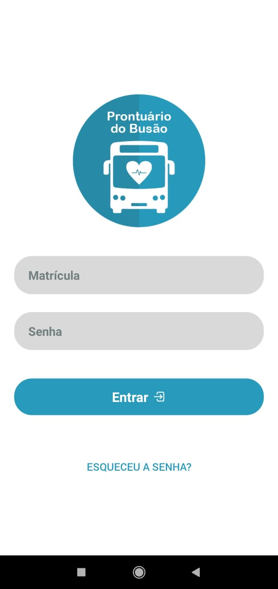
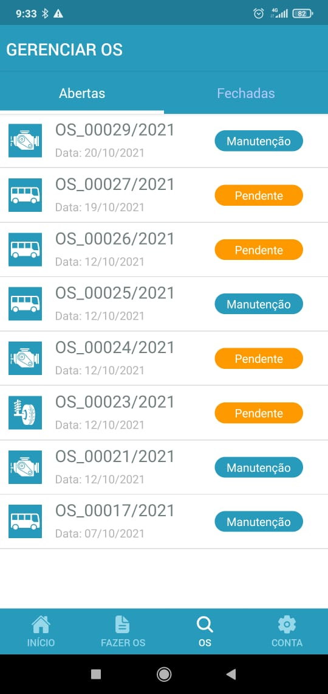
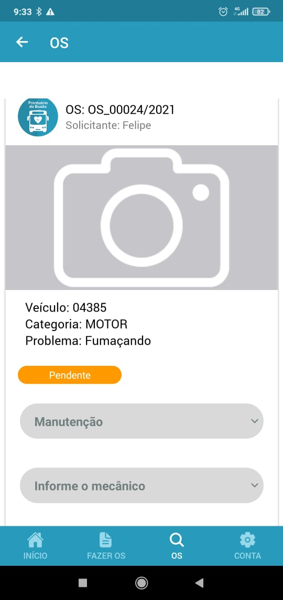
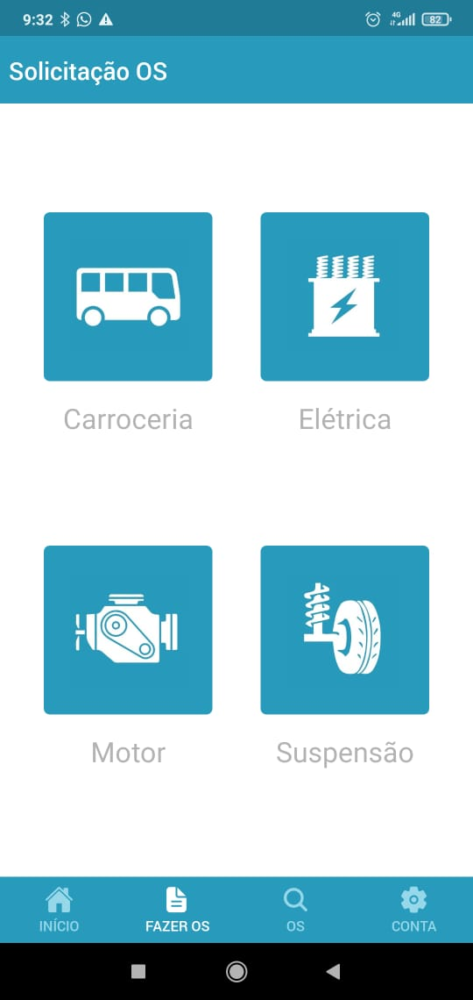

# Aplicativo Móvel Prontuário do Busão.
<h1 align="center">
  
</h1>

<p align="center">
  

  
</p>

## 💻 Sobre o projeto

A Prontuário do Busão é uma solução que se baseia na coleta de dados relacionados a manutenção da frota, e um dashboard de indicadores estratégicos e de previsibilidade.

Funcionalidades
- Cadastro de ordens de serviços 
- Gerenciamento de ordens de serviços

## 🎨 Layout

### Mobile

<p style="display: flex; align-items: flex-start; justify-content: space-between;">
  
  
  
  
</p>

# 🛠 Tecnologias

As seguintes ferramentas foram usadas na construção do projeto:
- [Node.js](https://nodejs.org/en/)
- [React](https://pt-br.reactjs.org/)
- [React Native](https://reactnative.dev)
- [TypeScript](https://www.typescriptlang.org/)

Pré-requisitos
Antes de começar, você vai precisar ter instalado em sua máquina as seguintes ferramentas: Git, Node.js.

💡 Este projeto tem como pré-requisito uso do projeto WEB do Prontuário do Busão, que pode ser encontrado neste [Link](https://github.com/prontuariodobusao/web_pdb).

### 🧭 Rodando a aplicativo em desenvolvimento

```bash
# Clone este repositório
$ git clone https://github.com/prontuariodobusao/app_pdb.git

# Acesse a pasta do projeto no seu terminal/cmd
$ cd app_pdb

# Instale as dependências
$ yarn install
```

```bash
# Executar no IOS
# É necessário instalar a gem cocoapods
$ gem install cocoapods
# Acesse a pasta ios e instale as dependências
$ cd ./ios && pod install
# Execute o comando na raiz do
$ yarn ios
```

```bash
# Executar no android
$ yarn android
```
## 📝 Licença

Este projeto esta sobe a licença GPL - 2.0.

Feito pela equipe Pontuário do Busão para o projeto move Teresina da Prefeitura de Teresina.

🚀 Equipe de desenvolvimento

#### Jorge Luis Lima - Arquiteto de Software  [Contato](https://www.linkedin.com/in/jorge-lima-1a45a197)
#### Thiago Aderaldo - Analista de sistemas  [Contato](https://www.linkedin.com/in/thiago-aderaldo-lessa-2b7b0646)
#### . - Analista de negócio  [Contato](https://www.linkedin.com/in/sebasti%C3%A3o-junior-52b2b58a)